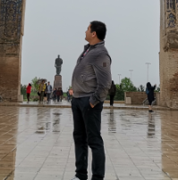

```{r setup, include=FALSE}
# Pakete laden
library(tidyverse)
library(dplyr)
library(ggplot2)
library(ggthemes)
```

> "Gebildet ist, wer weiß, wo er findet, was er nicht weiß."
>
> --- Georg Simmel

---

<div class="column left">
|<i class="fas fa-user-tie"></i>|Persönliche Daten||
|:---------:|:---------|---------:|
|<i class="fas fa-calendar-alt"></i>|**Geburtsdatum:**|DD.MM.19YY|
|<i class="fas fa-globe-asia"></i>|**Geburtsort:**|Earth|
|<i class="fas fa-home"></i>|**Adresse:**|Somewhere|
|<i class="fas fa-envelope"></i>|**E-Mail:**|example@mail.com|
|<i class="fas fa-phone-square"></i>|**Telefon:**|+49(0)1234 5678901|
</div>

<div class="column right">
```{r pressure, echo=FALSE, out.width = '50%'}

```
</div>

---

# <i class="fas fa-briefcase"></i> Berufserfahrungen

+--------------------+--------------------------------------+
|                    |                                      |
+:===================+:=====================================+
|***12/2016-***\     |**Arbeitnehmer**\                     |
|***Aktuell***       |MusterFirma AG\                       |
|                    |- *Aufgabe X*\                        |
|                    |- *Aufgabe Y*\                        |
|                    |- *...*                               |
+--------------------+--------------------------------------+
|***09/2011***\      |**Arbeitnehmer**\                     |
|***11/2016***       |MusterFirma GmbH\                     |
|                    |- *Aufgabe X*\                        |
|                    |- *Aufgabe Y*\                        |
|                    |- *...*                               |
+--------------------+--------------------------------------+


# <i class="fas fa-award"></i> Weiterbildung

+--------------------+--------------------------------------+
|                    |                                      |
+:===================+:=====================================+
|***03/2013-***\     |**R Language for Everyone**\          |            
|***04/2014***       |Akademisches Zentrum e.V.\            |
|                    |*Zertifikat*                          |
+--------------------+--------------------------------------+


# <i class="fas fa-graduation-cap"></i> Akademische Ausbildung

+--------------------+--------------------------------------+
|                    |                                      |
+:===================+:=====================================+
|***04/2009-***\     |**Masterstudium**\                    |            
|***01/2011***       |XY University\                        |
|                    |*Master of Arts (M.A.)*               |
+--------------------+--------------------------------------+
|***01/2006-***\     |**Bacherorstudium**\                  |            
|***04/2009***       |XY University\                        |
|                    |*Bachelor of Science (B.Sc.)*         |
+--------------------+--------------------------------------+


# <i class="fab fa-leanpub"></i> Schulische Ausbildung

+--------------------+--------------------------------------+
|                    |                                      |
+:===================+:=====================================+
|***06/2003-***\     |**Abitur**\                           |            
|***09/1992***       |XY Gymnasium                          |
+--------------------+--------------------------------------+

---

# <i class="fas fa-code"></i> IT Kenntnisse

```{r include=FALSE}
it <- c("C", "C++", "Java", "CSS", "HTML", "PHP", "MSSQL", "MySql", "Python", "R")
level <- as.factor(c(20, 25,30, 40, 55, 65, 70, 75, 85, 90 ))
# Data Frame
df <- data.frame(it,level)
#
# Plot
ggBar <- ggplot(df) +
  geom_bar(aes(x=it, y=fct_reorder(level, it)), colour ="black",
           fill="skyblue1", stat = "identity") +
  coord_flip() +
  labs(y = NULL,
       x = NULL,
       title = NULL)+
  theme(legend.position = "none",
        panel.grid = element_blank(),
        axis.title = element_blank(),
        axis.ticks.x = element_blank(),
        axis.text.x = element_blank(),
        panel.background = element_blank())
  #theme_tufte(ticks=FALSE)
```

```{r echo = FALSE}
ggBar
```

---

# <i class="fas fa-comments"></i> Sprachkenntnisse

```{r include = FALSE }
language <- c("Usbekisch", "Englisch", "Russisch", "Deutsch", "Chenesisch", "Koreanisch")
llevel <- as.factor(c(100, 75, 85, 50, 40, 30 ))
# DataFrame bilden
dfl <- data.frame(language,llevel)
# Plot
ggLang <- ggplot(dfl) +
  geom_bar(aes(x=language, y=llevel), colour ="black",
           fill = "skyblue" , stat = "identity") +
  labs(y = NULL,
       x = NULL,
       title = NULL)+
  theme(legend.position = "none",
        panel.grid = element_blank(),
        axis.title = element_blank(),
        axis.ticks.y = element_blank(),
        axis.text.y = element_blank(),
        panel.background=element_blank())
  #theme_tufte(ticks=FALSE)
```

```{r echo = FALSE}
# Plot ausgeben
ggLang
```

---

# <i class="fas fa-chess"></i> Interesse & Hobbies

- Sport
- Kochen
- Lesen
- etc...

---

